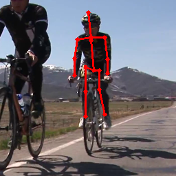
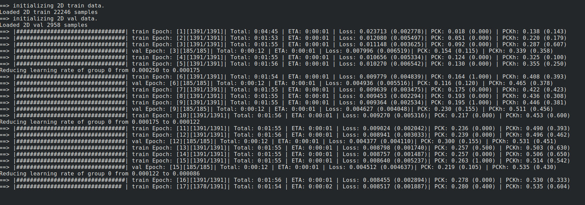

# Pytorch-Human-Pose-Estimation
This repository provides implementation with training/testing codes of various human pose estimation architectures in Pytorch
Authors : [Naman Jain](https://github.com/Naman-ntc) and [Sahil Shah](https://github.com/sahil00199)

Some visualizations from pretrained models:

------------------------
 | 

## Networks Implemented
* [DeepPose](https://static.googleusercontent.com/media/research.google.com/en//pubs/archive/42237.pdf) - multiple resnet/inception base networks [Pretrained Models Available (MPII and COCO)]
* [Stacked HourGlass Network](https://arxiv.org/pdf/1603.06937.pdf) - standard hourglass architecture [Pretrained Models Available (MPII and COCO)]
* [Chained Predictions Network](https://arxiv.org/pdf/1605.02346.pdf) - Sequential prediction of joints [Pretrained Models Available (MPII and COCO)]
* [Pose-Attention](https://arxiv.org/pdf/1702.07432.pdf) - soft attention network
* [PyraNet](https://arxiv.org/pdf/1708.01101.pdf) - pyramid residual modules, fractional maxpooling

### Upcoming Networks
* [IEF](https://arxiv.org/pdf/1507.06550.pdf)
* [DLCM](http://openaccess.thecvf.com/content_ECCV_2018/papers/Wei_Tang_Deeply_Learned_Compositional_ECCV_2018_paper.pdf)

## Datasets
* [MPII](http://human-pose.mpi-inf.mpg.de/)
* [COCO](http://cocodataset.org/#home)

## Requirements
* pytorch == 0.4.1
* torchvision ==0.2.0
* scipy
* configargpare
* progress
* json_tricks
* Cython

## Installation & Setup
`pip install -r requirements.txt`

For setting up MPII dataset please follow [this link](https://github.com/princeton-vl/pose-hg-train#getting-started) and update the `dataDir` parameter in [mpii.defconf](./conf/datasets/mpii.defconf) configration file. Also please download and unzip [this folder](https://www.cse.iitb.ac.in/~namanjain/mpii.zip) and updates the paths for `worldCoors` & `headSize` in the config file.

For setting up COCO dataset please follow [this link](https://github.com/Microsoft/human-pose-estimation.pytorch#quick-start) and update the `dataDir` parameter in [coco.defconf](./conf/datasets/coco.defconf)

## Usage
There are two important parameters that are required for running, `DataConfig` and `ModelConfig`. 
Corresponding to both datasets (MPII & COCO) config files are provided in the `conf/datasets` folder. 
Corresponding to all models implemented config files are provided in `conf/models` folder. 

To train a model please use
```
python main.py -DataConfig conf/datasets/[DATA].defconf -ModelConfig conf/models/[MODEL_NAME].defconf
-ModelConfig config file for the model to use
-DataConfig config file for the dataset to use
```

To continue training a pretrained model please use
```
python main.py -DataConfig conf/datasets/[DATA].defconf -ModelConfig conf/models/[MODEL_NAME].defconf --loadModel [PATH_TO_MODEL]
-ModelConfig config file for the model to use
-DataConfig config file for the dataset to use
--loadModel path to the .pth file for the model (containing state dicts of model, optimizer and epoch number)
(use [-test] to run only the test epoch)
```

Further options can (and should!) be tweaked from the model and data config files (in the `conf` folder).

The training window looks like this (Live-Updating Progress Bar Support): 


To download the pretrained-models please use [this link](https://www.cse.iitb.ac.in/~namanjain/models.zip).

## PreTrained Models
Model | DataSet | Performance
--- | --- | ---
ChainedPredictions | MPII | PCKh : 81.8
StachedHourGlass |  MPII | PCKh : 87.6
DeepPose |  MPII | PCKh : 54.2
ChainedPredictions | COCO | PCK : 82
StachedHourGlass | COCO | PCK : 84.7
DeepPose | COCO | PCK : 70.4	

## Acknowledgements
We used help of various open source implementations. We would like to thank [Microsoft Human Pose Estimation](https://github.com/Microsoft/human-pose-estimation.pytorch) for providing dataloader for COCO, [Xingi Zhou's 3D Hourglass Repo](https://github.com/xingyizhou/pytorch-pose-hg-3d) for MPII dataloader and HourGlass Pytorch Codebase. We would also like to thank [PyraNet](https://github.com/bearpaw/PyraNet) & [Attention-HourGlass](https://github.com/bearpaw/pose-attention) for open-sourcing their code in lua.

## To Do
* Implement code for showing the MAP performance on the COCO dataset
* Add visualization code
* Add more models
* Add visdom support

We plan (and will try) to complete these very soon!!

